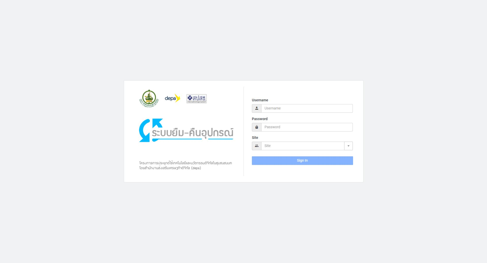
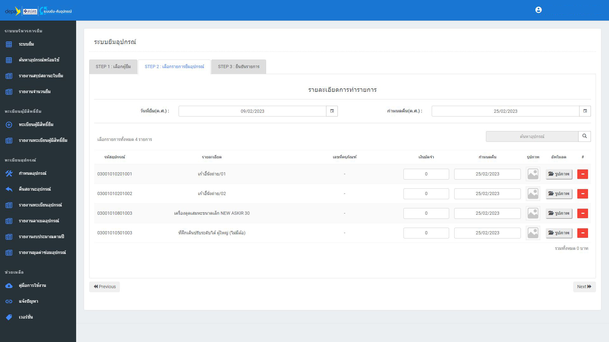

# medical-equipment borrow 

Medical equipment management system Used for storing the borrower's history. And can see the history of borrowing - returning of medical equipment with reports to view statistics and be analyzed in the future.

<h3>
Tool :
</h3>

Programming : AngularJS / PHP 

UI-Framwork : Bootstrap 

<h3>
Screen Short :
</h3>

